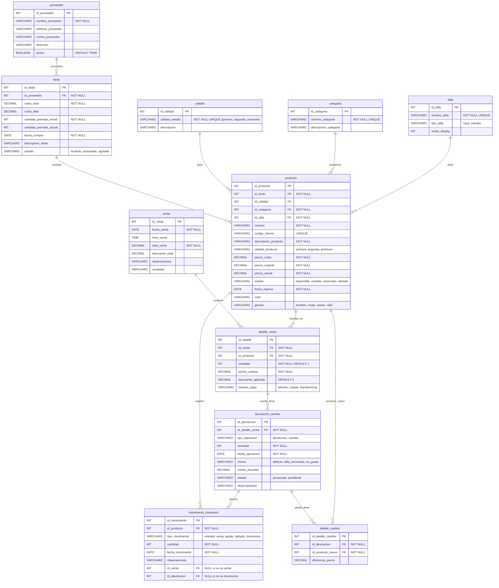

```mermaid
erDiagram
    proveedor {
        INT id_proveedor PK 
        VARCHAR2 nombre_proveedor "NOT NULL" 
        VARCHAR2 telefono_proveedor
        VARCHAR2 correo_proveedor
        VARCHAR2 direccion
        BOOLEAN activo "DEFAULT TRUE"
    }

    fardo {
        INT id_fardo PK
        INT id_proveedor FK "NOT NULL"
        DECIMAL costo_total "NOT NULL"
        DECIMAL costo_flete
        INT cantidad_prendas_inicial "NOT NULL"
        INT cantidad_prendas_actual
        DATE fecha_compra "NOT NULL"
        VARCHAR2 descripcion_fardo
        VARCHAR2 estado "recibido, procesado, agotado"
    }

    producto {
        INT id_producto PK 
        INT id_fardo FK "NOT NULL"
        INT id_calidad FK
        INT id_categoria FK "NOT NULL"
        INT id_talla FK "NOT NULL"
        VARCHAR2 nombre "NOT NULL"
        VARCHAR2 codigo_interno "UNIQUE"
        VARCHAR2 descripcion_producto "NOT NULL"
        VARCHAR2 calidad_producto "primera, segunda, premium"
        DECIMAL precio_costo "NOT NULL"
        DECIMAL precio_original "NOT NULL"
        DECIMAL precio_actual "NOT NULL"
        VARCHAR2 estado "disponible, vendido, reservado, dañado"
        DATE fecha_ingreso "NOT NULL"
        VARCHAR2 color
        VARCHAR2 genero "hombre, mujer, unisex, niño"
    }

    calidad {
        INT id_calidad PK
        VARCHAR2 calidad_estado "NOT NULL UNIQUE (primera, segunda, premium)"
        VARCHAR2 descripcion
    }

    categoria {
        INT id_categoria PK
        VARCHAR2 nombre_categoria "NOT NULL UNIQUE"
        VARCHAR2 descripcion_categoria
    }

    talla {
        INT id_talla PK
        VARCHAR2 nombre_talla "NOT NULL UNIQUE"
        VARCHAR2 tipo_talla "ropa, calzado"
        INT orden_display
    }

    venta {
        INT id_venta PK
        DATE fecha_venta "NOT NULL"
        TIME hora_venta
        DECIMAL total_venta "NOT NULL"
        DECIMAL descuento_total
        VARCHAR2 observaciones
        VARCHAR2 vendedor
    }

    detalle_venta {
        INT id_detalle PK
        INT id_venta FK "NOT NULL"
        INT id_producto FK "NOT NULL"
        INT cantidad "NOT NULL DEFAULT 1"
        DECIMAL precio_unitario "NOT NULL"
        DECIMAL descuento_aplicado "DEFAULT 0"
        VARCHAR2 metodo_pago "efectivo, tarjeta, transferencia"
    }

    devolucion_cambio {
        INT id_devolucion PK
        INT id_detalle_venta FK "NOT NULL"
        VARCHAR2 tipo_operacion "devolucion, cambio"
        INT cantidad "NOT NULL"
        DATE fecha_operacion "NOT NULL"
        VARCHAR2 motivo "defecto, talla_incorrecta, no_gusta"
        DECIMAL monto_devuelto
        VARCHAR2 estado "procesado, pendiente"
        VARCHAR2 observaciones
    }

    detalle_cambio {
        INT id_detalle_cambio PK
        INT id_devolucion FK "NOT NULL"
        INT id_producto_nuevo FK "NOT NULL"
        DECIMAL diferencia_precio
    }

    movimiento_inventario {
        INT id_movimiento PK
        INT id_producto FK "NOT NULL"
        VARCHAR2 tipo_movimiento "entrada, venta, ajuste, dañado, devolucion"
        INT cantidad "NOT NULL"
        DATE fecha_movimiento "NOT NULL"
        VARCHAR2 observaciones
        INT id_venta FK "NULL si no es venta"
        INT id_devolucion FK "NULL si no es devolucion"
    }

    %% Relaciones
    proveedor ||--o{ fardo : suministra
    fardo ||--o{ producto : contiene
    calidad||--o{ producto : tiene
    categoria ||--o{ producto : pertenece
    talla ||--o{ producto : tiene
    venta ||--o{ detalle_venta : contiene
    producto ||--o{ detalle_venta : vendido_en
    producto ||--o{ movimiento_inventario : registra
    detalle_venta ||--o{ devolucion_cambio : puede_tener
    devolucion_cambio ||--o{ detalle_cambio : puede_tener
    producto ||--o{ detalle_cambio : producto_nuevo
    devolucion_cambio ||--o{ movimiento_inventario : genera

```